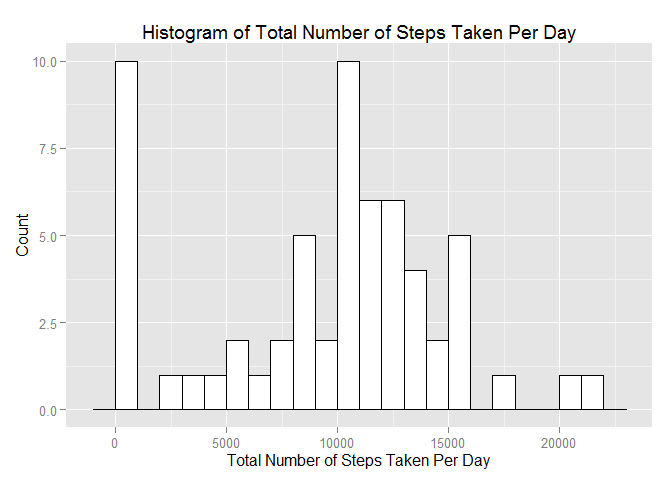
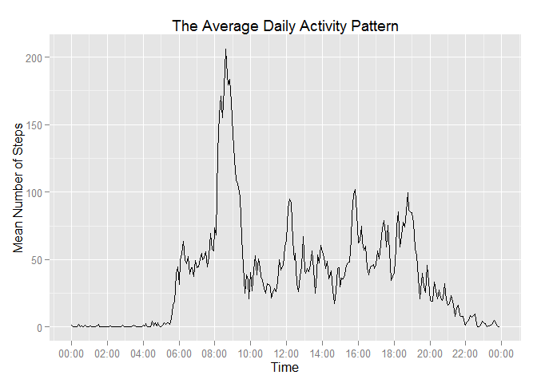
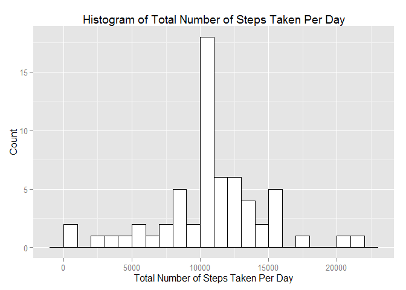
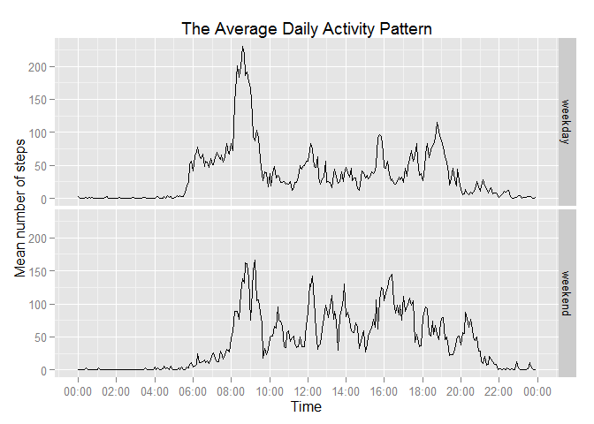

# Reproducible Research: Peer Assessment 1

## Libraries

```r
library(dplyr)
```

```
## Warning: package 'dplyr' was built under R version 3.1.3
```

```
## 
## Attaching package: 'dplyr'
## 
## The following objects are masked from 'package:stats':
## 
##     filter, lag
## 
## The following objects are masked from 'package:base':
## 
##     intersect, setdiff, setequal, union
```

```r
library(ggplot2)
```

```
## Warning: package 'ggplot2' was built under R version 3.1.3
```

```r
library(scales)
```

```
## Warning: package 'scales' was built under R version 3.1.3
```

## Loading and preprocessing the data

```r
data <- read.csv(unz("activity.zip", "activity.csv"))
data$time <- as.POSIXct(paste(sprintf("%04d", data$interval) , "2015-07-18"), format = "%H%M %Y-%m-%d")
data$datetime <- as.POSIXct(paste(sprintf("%04d", data$interval) , data$date), format = "%H%M %Y-%m-%d")
data$day <- factor(ifelse(format(data$datetime,"%w") %in% c("0", "6"), "weekend", "weekday"))
```

## What is mean total number of steps taken per day?
First calculate the total number of steps taken per day.

```r
data <- group_by(data, date)
data.perDay <- summarise(data, totalSteps = sum(steps, na.rm = TRUE))
```

Then make a histogram of the total number of steps taken each day.

```r
ggplot(data.perDay, aes(x = totalSteps)) + 
                    geom_histogram(binwidth=1000, colour="black", fill="white") + 
                    labs(title = "Histogram of Total Number of Steps Taken Per Day", x = "Total Number of Steps Taken Per Day", y = "Count")
```

 

Finally calculate and report the mean and median of the total number of steps taken per day.

```r
summarise(data.perDay, mean = mean(totalSteps), median = median(totalSteps))
```

```
## Source: local data frame [1 x 2]
## 
##      mean median
## 1 9354.23  10395
```

## What is the average daily activity pattern?
Make a time series plot of the 5-minute interval (x-axis) and the average number of steps taken, averaged across all days (y-axis).

```r
data <- group_by(data, time)
data.perInterval <- summarise(data, meanSteps = mean(steps, na.rm = TRUE))
lims <- as.POSIXct(strptime(c("2015-07-18 00:00","2015-07-18 23:55"), format = "%Y-%m-%d %H:%M"))    
ggplot(data.perInterval, aes(x = time, y = meanSteps)) + 
                         geom_line() + 
                         scale_x_datetime(limits = lims, breaks = date_breaks("2 hour"), labels = date_format("%H:%M")) + 
                         labs(title = "The Average Daily Activity Pattern", x = "Time", y = "Mean Number of Steps")
```

 

Calculate the 5-minute interval that contains the maximum number of steps on average across all the days.

```r
format(data.perInterval[data.perInterval$meanSteps == max(data.perInterval$meanSteps), c("time")], "%H:%M") 
```

```
##    time
## 1 08:35
```

## Imputing missing values
Calculate and report the total number of missing values in the dataset.

```r
sum(is.na(data))
```

```
## [1] 2304
```

Fill in missing values with the mean for the 5-minute interval.

```r
data.imputed <- inner_join(data, data.perInterval)
```

```
## Joining by: "time"
```

```r
missing <- is.na(data.imputed$steps)
data.imputed$steps[missing] <- data.imputed$meanSteps[missing]
```

Make a histogram of the total number of steps taken each day. Use the new dataset without missing values.

```r
data.imputed <- group_by(data.imputed, date)
data.perDay <- summarise(data.imputed, totalSteps = sum(steps, na.rm = TRUE))
ggplot(data.perDay, aes(x = totalSteps)) + 
                    geom_histogram(binwidth=1000, colour="black", fill="white") + 
                    labs(title = "Histogram of Total Number of Steps Taken Per Day", x = "Total Number of Steps Taken Per Day", y = "Count")
```

 

Calculate and report the mean and median of the total number of steps taken per day.

```r
summarise(data.perDay, mean = mean(totalSteps), median = median(totalSteps))
```

```
## Source: local data frame [1 x 2]
## 
##       mean   median
## 1 10766.19 10766.19
```

After imputing missing values:  

* the mean and median values are higher,  
* the mean and median values are equal to each other.

## Are there differences in activity patterns between weekdays and weekends?
Make a panel plot containing a time series plot of the 5-minute interval (x-axis) and the average number of steps taken, averaged across all weekday days or weekend days (y-axis).

```r
data.imputed <- group_by(data.imputed, time, day)
data.perInterval <- summarise(data.imputed, meanSteps = mean(steps, na.rm = TRUE))
lims <- as.POSIXct(strptime(c("2015-07-18 00:00","2015-07-18 23:55"), format = "%Y-%m-%d %H:%M"))    
ggplot(data.perInterval, aes(x = time, y = meanSteps)) + 
                    geom_line() + 
                    facet_grid(day ~ .) +
                    scale_x_datetime(limits = lims, breaks = date_breaks("2 hour"), labels = date_format("%H:%M")) + 
                    labs(title = "The Average Daily Activity Pattern", x = "Time", y = "Mean number of steps")
```

 

During the weekend there is less activity early in the morning and more activity in the evening than on weekdays.
